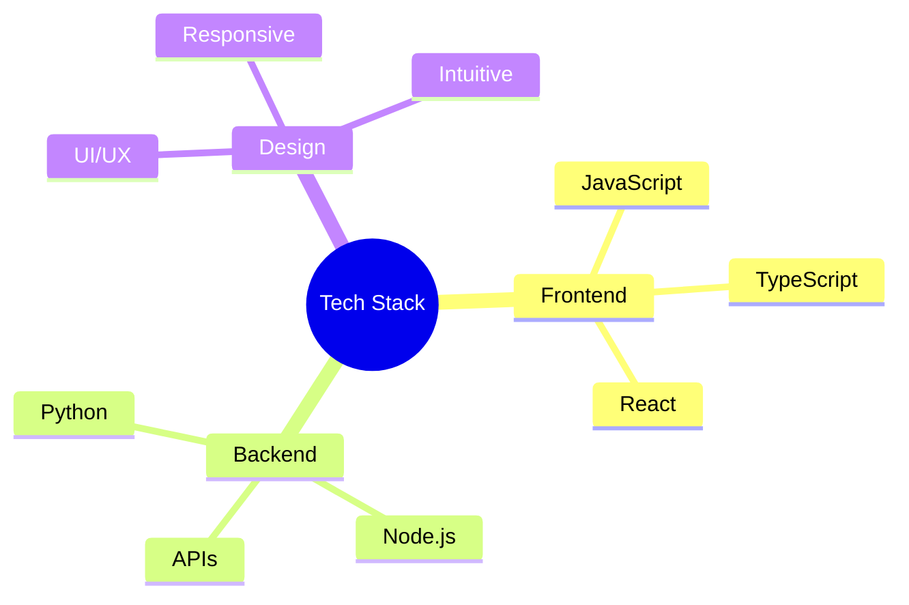

<div align="center">
  
<!-- Title Section -->


<h1>
    
</h1>

*Spinning webs of code from Navi Mumbai, India 🇮🇳*

</div>

<!-- About Section -->
```typescript
class WebDeveloper {
    name: string = "Sam";
    location: string = "Navi Mumbai, IN";
    role: string = "Full-Stack Developer & UI/UX Designer";
    superPowers: {[key: string]: string} = {
        webSlinging: "JavaScript Mastery",
        spiderSense: "UI/UX Intuition",
        webShooting: "Python Expertise",
        wallCrawling: "TypeScript Skills"
    };
    
    constructor() {
        console.log("Your friendly neighborhood developer is online! 🕸️");
    }
}
```

<!-- Stats Section -->
<div align="center">
  
### 🕸️ Web Development Stats


</div>

<!-- Skills Section -->
### 🕷️ Tech Arsenal

<div align="center">



</div>

<!-- Featured Project -->
### 🎯 Featured Web
<div align="center">
  
[](https://github.com/SamAi0/ChatRizz-plus)

</div>

<!-- Achievements Section -->
### 🏆 Web-Slinging Achievements

<table align="center">
  <tr>
    <td align="center"><b>56</b><br>Contributions</td>
    <td align="center"><b>32</b><br>Repositories</td>
    <td align="center"><b>32</b><br>Stars Earned</td>
    <td align="center"><b>5</b><br>Followers</td>
  </tr>
</table>

<!-- Skills Animation -->
<div align="center">

### 🌐 Development Powers


</div>

<!-- Connect Section -->
### 🤝 Connect With Me

<div align="center">
  
[](https://github.com/SamAi0)

*"With great coding power comes great responsibility"*

</div>

<!-- Footer -->
<div align="center">


<sub> Profile Views: </sub>
</div>
