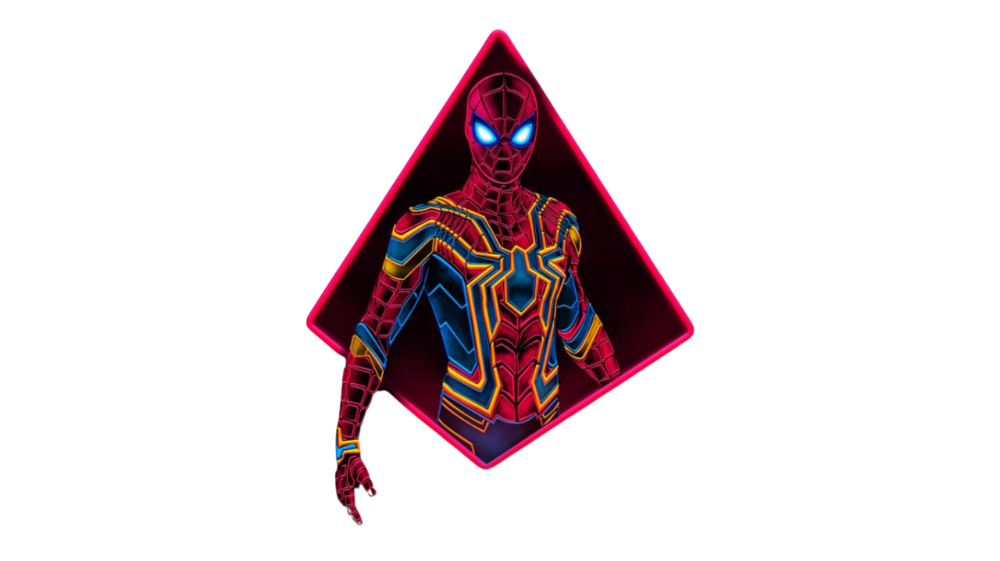
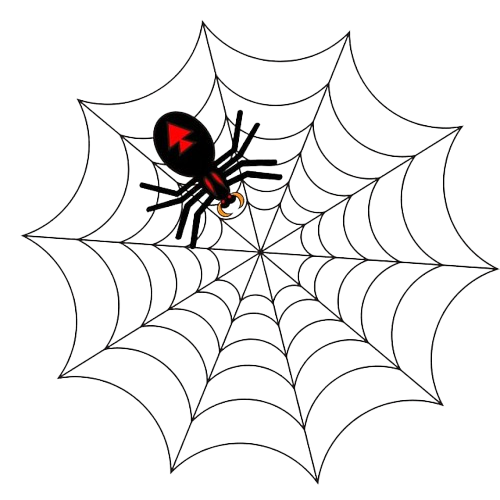
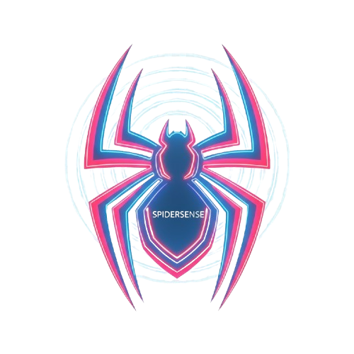

<!-- 🕷️ SpiderSense — GitHub Profile README | Dashboard Edition -->

<!-- Hero Banner Section -->

  
  

    <svg width="100%" height="100" xmlns="http://www.w3.org/2000/svg" style="max-width: 400px;">
      <defs>
        <linearGradient id="animatedGradient" x1="0%" y1="0%" x2="100%" y2="0%">
          <stop offset="0%" stop-color="#E60023" stop-opacity="1">
            <animate attributeName="stop-color" values="#E60023;#00AEEF;#E60023" dur="3s" repeatCount="indefinite"/>
          </stop>
          <stop offset="50%" stop-color="#00AEEF" stop-opacity="1">
            <animate attributeName="stop-color" values="#00AEEF;#E60023;#00AEEF" dur="3s" repeatCount="indefinite"/>
          </stop>
          <stop offset="100%" stop-color="#E60023" stop-opacity="1">
            <animate attributeName="stop-color" values="#E60023;#00AEEF;#E60023" dur="3s" repeatCount="indefinite"/>
          </stop>
          <animateTransform attributeName="gradientTransform" type="translate" values="0 0;100 0;0 0" dur="3s" repeatCount="indefinite"/>
        </linearGradient>
        <filter id="glow">
          <feGaussianBlur stdDeviation="3" result="coloredBlur"/>
          <feMerge>
            <feMergeNode in="coloredBlur"/>
            <feMergeNode in="SourceGraphic"/>
          </feMerge>
        </filter>
      </defs>
      <text x="50%" y="50%" dominant-baseline="middle" text-anchor="middle" font-size="64" font-weight="bold" fill="url(#animatedGradient)" filter="url(#glow)" font-family="Arial, sans-serif">SamAi0</text>
    </svg>
  

<!-- Identity Section -->
<h1 align="center" style="margin: 10px 0;">
  
   
  SpiderSense Web-Slinger
</h1>

  <em>With great power comes great code.</em>

<!-- Status Badges -->

  
  
  
  

<!-- Quick Links -->

  
  
  

<!-- Visual Divider -->

---

<!-- Dashboard Container -->

<!-- 🧑‍💻 ABOUT ME SECTION -->

<h2 align="center" style="margin: 0 0 20px 0; color: #00AEEF;">
  🧑‍💻 About Me
</h2>

  <svg width="60" height="60" viewBox="0 0 24 24" fill="none" xmlns="http://www.w3.org/2000/svg">
    <circle cx="12" cy="12" r="9" stroke="#00AEEF" stroke-width="1.5" opacity="0.8"/>
    <path d="M12 3v18M3 12h18M5.64 5.64l12.72 12.72M18.36 5.64L5.64 18.36" stroke="#E60023" stroke-width="1.2" stroke-linecap="round" opacity="0.8"/>
  </svg>

  Hi, I'm <strong style="color: #00AEEF;">Sam</strong>, a developer crafting digital webs with precision and creativity. 
  I blend cutting-edge technology with intuitive design to build immersive experiences.

<!-- Tech Stack Dashboard -->

<h3 style="color: #E60023; margin: 0 0 15px 0;">🕸️ Tech Arsenal</h3>

**Frontend**

  
  
  
  

**Backend**

  
  
  
  

**Tools & Others**

  
  
  
  
  
  

  

---

<!-- 🚀 CURRENT FOCUS SECTION -->

<h2 align="center" style="margin: 0 0 20px 0; color: #E60023;">
  🚀 Currently
</h2>

  <svg width="60" height="60" viewBox="0 0 24 24" fill="none" xmlns="http://www.w3.org/2000/svg">
    <circle cx="12" cy="12" r="9" stroke="#00AEEF" stroke-width="1.4" opacity="0.8"/>
    <path d="M5.64 5.64l12.72 12.72" stroke="#E60023" stroke-width="1.2" stroke-linecap="round" opacity="0.8"/>
  </svg>

<ul style="color: #e0e0e0; line-height: 2; font-size: 1.05em;">
  <li style="margin: 10px 0;">🕸️ Building <strong style="color: #00AEEF;">SpiderSense</strong> utilities and UI components</li>
  <li style="margin: 10px 0;">⚡ Exploring animation systems and GPU-accelerated effects</li>
  <li style="margin: 10px 0;">🎨 Crafting design-heavy React/Next.js projects</li>
  <li style="margin: 10px 0;">🤝 Open to collaboration on innovative web experiences</li>
</ul>

---

<!-- 🕹️ FEATURED PROJECTS SECTION -->

<h2 align="center" style="margin: 0 0 30px 0; color: #00AEEF;">
  🕹️ Featured Projects
</h2>

  <svg width="60" height="60" viewBox="0 0 24 24" fill="none" xmlns="http://www.w3.org/2000/svg">
    <circle cx="12" cy="12" r="9" stroke="#00AEEF" stroke-width="1.5" opacity="0.8"/>
    <path d="M18.36 5.64L5.64 18.36" stroke="#E60023" stroke-width="1.2" stroke-linecap="round" opacity="0.8"/>
  </svg>

<!-- Projects Grid -->

<!-- Project 1: SpiderSense -->

<h3 align="center" style="color: #E60023; margin: 0 0 15px 0; font-size: 1.5em;">
  🧠 SpiderSense
</h3>

  Real-time error detection tool with intelligent monitoring

  

  
  

<!-- Project 2: WebSlinger -->

<h3 align="center" style="color: #00AEEF; margin: 0 0 15px 0; font-size: 1.5em;">
  🕸️ WebSlinger
</h3>

  GitHub history visualized like a spider web network

  

  
  

---

<!-- Visual Divider -->

  

---

<!-- 🏆 TROPHIES SECTION -->

<h2 align="center" style="margin: 0 0 30px 0; color: #00AEEF;">
  🏆 GitHub Trophies
</h2>

  <svg width="60" height="60" viewBox="0 0 24 24" fill="none" xmlns="http://www.w3.org/2000/svg">
    <circle cx="12" cy="12" r="9" stroke="#00AEEF" stroke-width="1.4" opacity="0.8"/>
    <path d="M5.64 5.64l12.72 12.72" stroke="#E60023" stroke-width="1.1" stroke-linecap="round" opacity="0.8"/>
  </svg>

  

---

<!-- 🗺️ CONTRIBUTIONS SECTION -->

<h2 align="center" style="margin: 0 0 30px 0; color: #E60023;">
  🗺️ Contribution Activity
</h2>

  <svg width="60" height="60" viewBox="0 0 24 24" fill="none" xmlns="http://www.w3.org/2000/svg">
    <circle cx="12" cy="12" r="9" stroke="#00AEEF" stroke-width="1.4" opacity="0.8"/>
    <path d="M12 3v18M3 12h18" stroke="#E60023" stroke-width="1.1" stroke-linecap="round" opacity="0.8"/>
  </svg>

  

---

<!-- 📊 GITHUB STATS SECTION -->

<h2 align="center" style="margin: 0 0 30px 0; color: #00AEEF;">
  📊 GitHub Stats
</h2>

  <svg width="60" height="60" viewBox="0 0 24 24" fill="none" xmlns="http://www.w3.org/2000/svg">
    <circle cx="12" cy="12" r="9" stroke="#00AEEF" stroke-width="1.4" opacity="0.8"/>
    <path d="M18.36 5.64L5.64 18.36" stroke="#E60023" stroke-width="1.1" stroke-linecap="round" opacity="0.8"/>
  </svg>

<!-- Stats Grid -->

  

  

  

---

<!-- 🎓 LEARNING SECTION -->

<h2 align="center" style="margin: 0 0 20px 0; color: #E60023;">
  🎓 Currently Learning
</h2>

  <svg width="60" height="60" viewBox="0 0 24 24" fill="none" xmlns="http://www.w3.org/2000/svg">
    <circle cx="12" cy="12" r="9" stroke="#00AEEF" stroke-width="1.4" opacity="0.8"/>
    <path d="M12 3v18M3 12h18" stroke="#E60023" stroke-width="1.1" stroke-linecap="round" opacity="0.8"/>
  </svg>

  
  
  
  

  Always expanding my web of knowledge! 🕸️

---

<!-- 💡 FUN FACTS SECTION -->

<h2 align="center" style="margin: 0 0 20px 0; color: #00AEEF;">
  💡 Fun Facts
</h2>

  <svg width="50" height="50" viewBox="0 0 24 24" fill="none" xmlns="http://www.w3.org/2000/svg">
    <circle cx="12" cy="12" r="9" stroke="#00AEEF" stroke-width="1.4" opacity="0.8"/>
    <path d="M12 3v18M3 12h18" stroke="#E60023" stroke-width="1.1" stroke-linecap="round" opacity="0.8"/>
  </svg>

<ul style="color: #e0e0e0; line-height: 2; font-size: 1.05em;">
  <li style="margin: 10px 0;">🕷️ I code like Spider-Man swings—with precision and style!</li>
  <li style="margin: 10px 0;">☕ Coffee is my web-fluid (fuel for coding sessions)</li>
  <li style="margin: 10px 0;">🎮 Love building games and interactive experiences in my spare time</li>
  <li style="margin: 10px 0;">🌐 Passionate about creating accessible and performant web experiences</li>
</ul>

---

<!-- 💬 CONNECT SECTION -->

<h2 align="center" style="margin: 0 0 20px 0; color: #00AEEF;">
  💬 Connect With Me
</h2>

  <svg width="50" height="50" viewBox="0 0 24 24" fill="none" xmlns="http://www.w3.org/2000/svg">
    <circle cx="12" cy="12" r="9" stroke="#00AEEF" stroke-width="1.4" opacity="0.8"/>
    <path d="M12 3v18M3 12h18" stroke="#E60023" stroke-width="1.1" stroke-linecap="round" opacity="0.8"/>
  </svg>

  Let's build something amazing together! Always open to collaboration and exciting projects.

  
  
  
  

  💬 <strong>Let's collaborate!</strong> Open to discussing projects, ideas, or just having a chat about web development.

---

<!-- Footer -->

  🕸️ <strong>SpiderSense</strong> · Designed for dark mode · Futuristic developer aesthetic

  <em>With great power comes great code.</em>

  
  

<!-- Animated Web SVG Footer -->

  <svg width="80" height="80" viewBox="0 0 24 24" fill="none" xmlns="http://www.w3.org/2000/svg">
    <circle cx="12" cy="12" r="9" stroke="#00AEEF" stroke-width="1.5" opacity="0.6"/>
    <path d="M12 3v18M3 12h18M5.64 5.64l12.72 12.72M18.36 5.64L5.64 18.36" stroke="#E60023" stroke-width="1.2" stroke-linecap="round" opacity="0.6"/>
  </svg>

